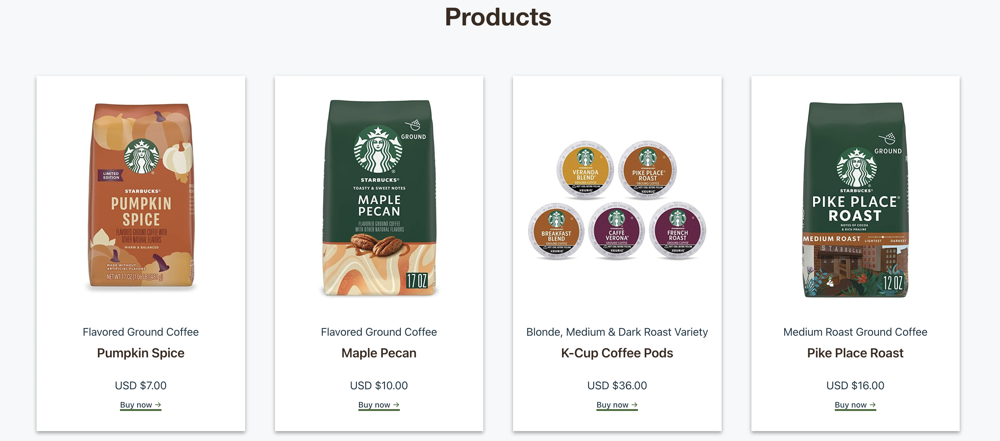
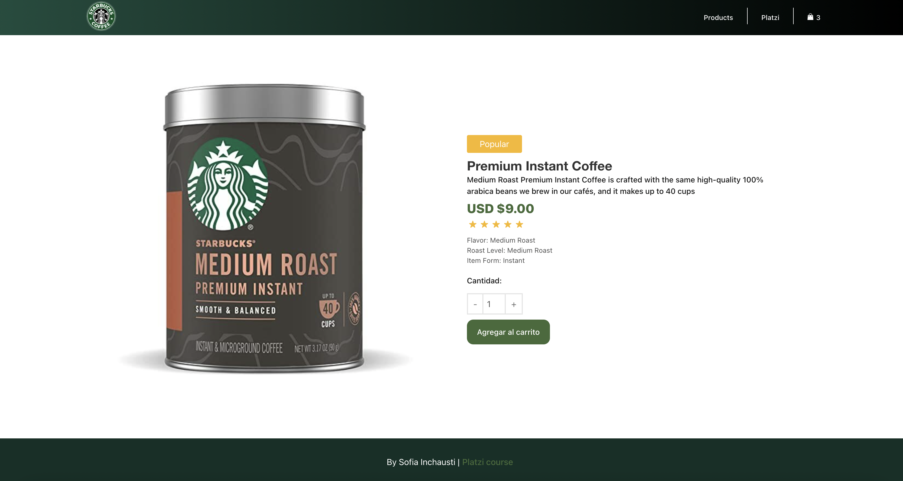
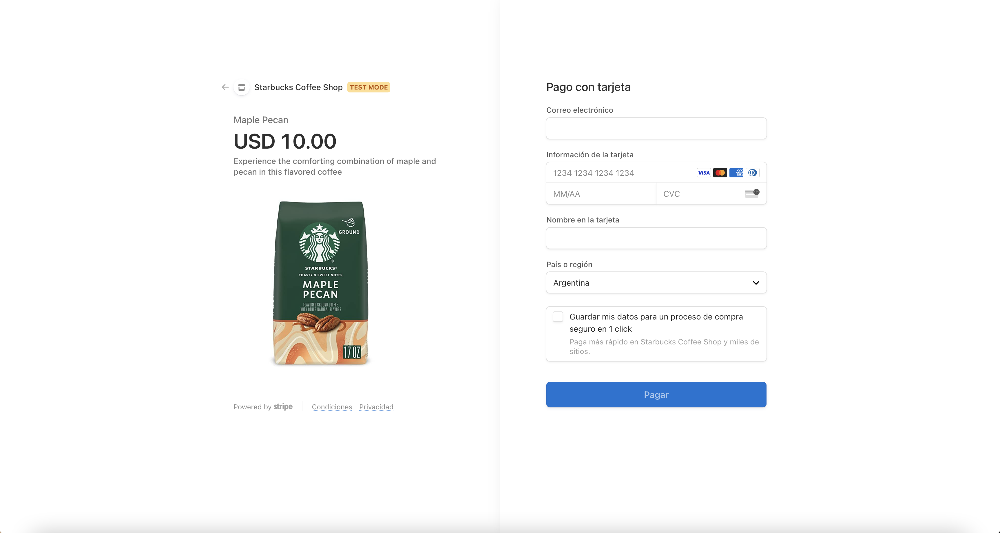

  

  <h1>Gatsby Starbucks Coffee Shop</h1>
  <a cursor="pointer" href="https://mk-sofiinchausti.netlify.app">Go to page</a>

<h4>Starbucks Coffee Shop is a practicing project based in a Platzi course</h4>

Functionalities:
- Show products available for purchase
- Add to cart
- Simulate a real purchase with Stripe

Technologies used: NodeJS- ReactJS- Gatsby- Stripe

<h3>Home<h3>
  
<h3>Products</h3>
  
 <h3>Product Details</h3>
  
<h3>Stripe Integration</h3>
  
  
